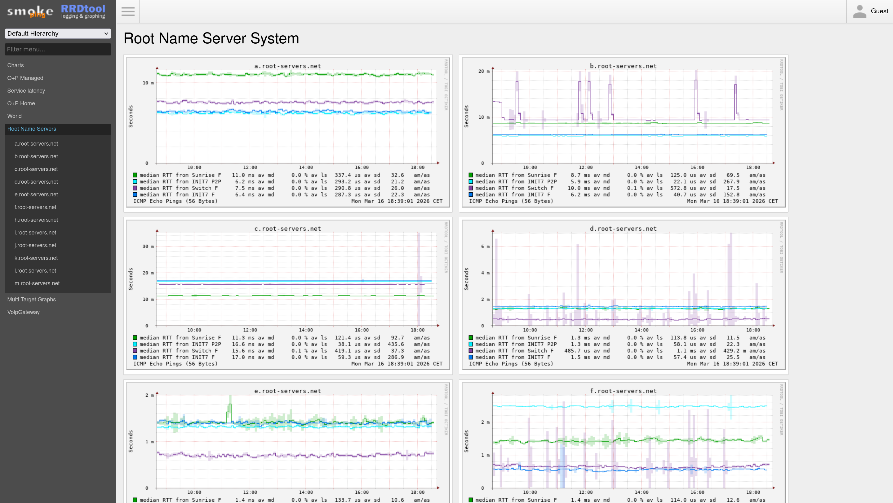

<div align="center">
    <h1>Cloudron SmokePing</h1>
    <p>A Cloudron community app packaging of <a href="https://oss.oetiker.ch/smokeping/">SmokePing</a> — latency logging, graphing, and alerting with RRDtool.</p>
</div>

<div align="center">

[](https://www.gnu.org/licenses/old-licenses/gpl-2.0.en.html)

</div>

## About this package

This repository contains only the Cloudron packaging files for SmokePing. The SmokePing source is downloaded from [oetiker/SmokePing](https://github.com/oetiker/SmokePing) at image-build time, pinned to a known release via the `SMOKEPING_VERSION` build arg (kept current automatically by Renovate).

The upstream SmokePing project is the authoritative source for the daemon, probes, and web UI; this repo provides the Dockerfile, nginx config, supervisor unit files, default configuration, and the operator-facing glue needed to run cleanly on Cloudron.

- Upstream: [oetiker/SmokePing](https://github.com/oetiker/SmokePing) — GPL-2.0
- Packaging: [pronetivity/cloudron-smokeping](https://github.com/pronetivity/cloudron-smokeping) — GPL-2.0

## Features

- ICMP, DNS, HTTP, SSH and 40+ other probe types — see [SmokePing probes](https://oss.oetiker.ch/smokeping/probe/index.en.html).
- ~80 default monitoring targets covering DNS resolvers, all 13 root servers, social networks, dev tools, and cloud providers.
- 10 pre-configured alert rules for packet loss, latency spikes, and flapping.
- HTTP basic auth with auto-generated credentials at `/app/data/htpasswd.txt`; overridable via `/app/data/.env`.
- Email alerts via the Cloudron `sendmail` addon. Surface-test with `/app/pkg/test-email.sh`.
- Split configuration files under `/app/data/config/` (General, Database, Alerts, Presentation, Probes, Targets). Deleting a file restores its default on next restart.
- Health check endpoint at `/healthz`.
- SVG graph format.

## Installing on a Cloudron

```bash
cloudron install --server my.example.com \
                 --versions-url https://raw.githubusercontent.com/pronetivity/cloudron-smokeping/master/CloudronVersions.json \
                 --location smokeping.example.com
```

Or in the Cloudron dashboard: **Settings → App Store → Add custom app** and paste the same `CloudronVersions.json` URL.

See [`PUBLISHING.md`](./PUBLISHING.md) for all install paths (`--versions-url`, `--image`, server-side build) and the publish workflow.

## Configuration

After install, edit `/app/data/.env` via the [Web Terminal](https://docs.cloudron.io/apps/#web-terminal):

```bash
TZ=Europe/Berlin
SMOKEPING_ALERT_TO=admin@example.com,ops@example.com
SMOKEPING_OWNER=My Company
```

Restart the app for changes to take effect. For advanced customization, edit the split config files under `/app/data/config/`.

## Testing email delivery

```bash
/app/pkg/test-email.sh your@email.com
```

The test message includes the container hostname, the Cloudron app domain, and the Cloudron host so alert-delivery diagnostics are unambiguous.

## Development

Local container build (no Cloudron required):

```bash
docker build -t cloudron-smokeping:dev .
```

Test against a Cloudron, building on the server:

```bash
cloudron install --server my.example.com --location smokeping.example.com
cloudron update  --server my.example.com --app smokeping.example.com
```

For the full release workflow (`scripts/release.js`, GitHub Actions build, GHCR push, GitHub Release, `cloudron versions add`) see [`VERSIONING.md`](./VERSIONING.md) and [`PUBLISHING.md`](./PUBLISHING.md).

## Reporting bugs

For issues with the **Cloudron packaging** (install, config-defaults, nginx, supervisor, env handling), open an issue here: [pronetivity/cloudron-smokeping/issues](https://github.com/pronetivity/cloudron-smokeping/issues).

For issues with **SmokePing itself** (probes, RRD storage, the web UI), open an issue upstream: [oetiker/SmokePing/issues](https://github.com/oetiker/SmokePing/issues).

## License

GPL-2.0. See the upstream [SmokePing COPYING](https://github.com/oetiker/SmokePing/blob/master/COPYING) for the underlying daemon's license. Packaging contributions in this repository are © 2026 ProNetivity Inc., released under the same GPL-2.0 license.
